# Pracheer Srivastava — Portfolio

An interactive portfolio built around a 3D Commodore PET 8296. The CRT is a
real terminal: type `help`, `ls`, `cd ~/projects`, `show 01-bitcoin-signet.md`
and it renders my project write-ups in amber phosphor, wrapped by a text layout
engine that draws every glyph as geometry.

**Live:** https://pracheersrivastava.github.io

[](https://github.com/pracheersrivastava/pracheersrivastava.github.io/actions/workflows/deploy.yml)


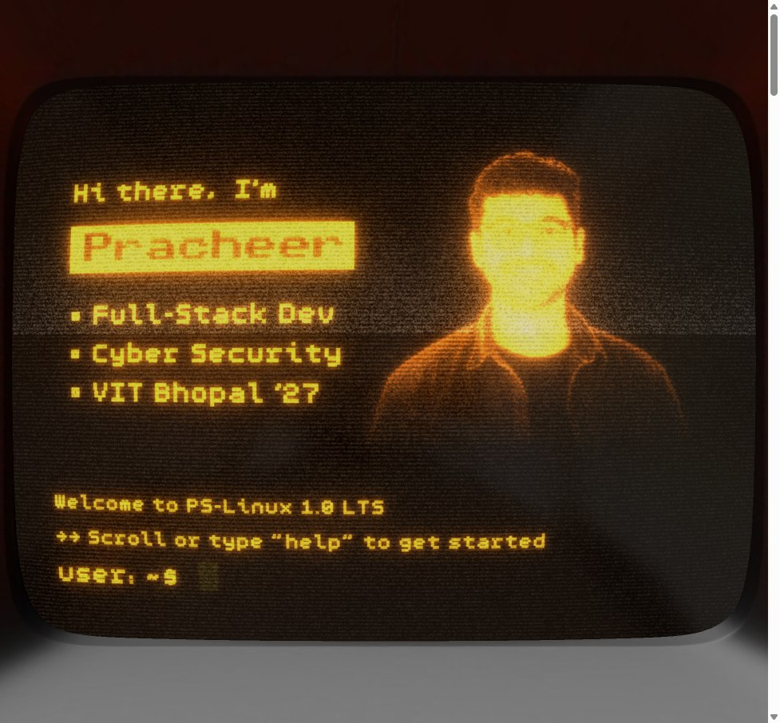

---

## Two surfaces, one set of facts

The site says the same things twice, in two very different registers.

The **CRT** is for people who like poking at things. It has a virtual
filesystem, a tiny UNIX-ish shell, and a markdown renderer that paints into a
render target which then goes through bloom, phosphor lag and scanline noise
before landing on the screen mesh.

The **page** below it is for people who just want to read. Scroll past the hero
and the camera pulls back off the machine, handing over to a stack of project
cards.

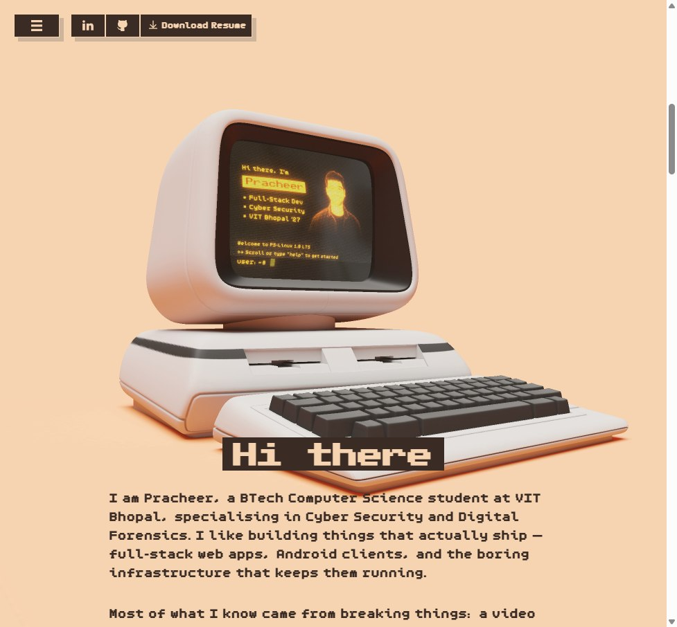

---

## Screenshots

### The shell actually works

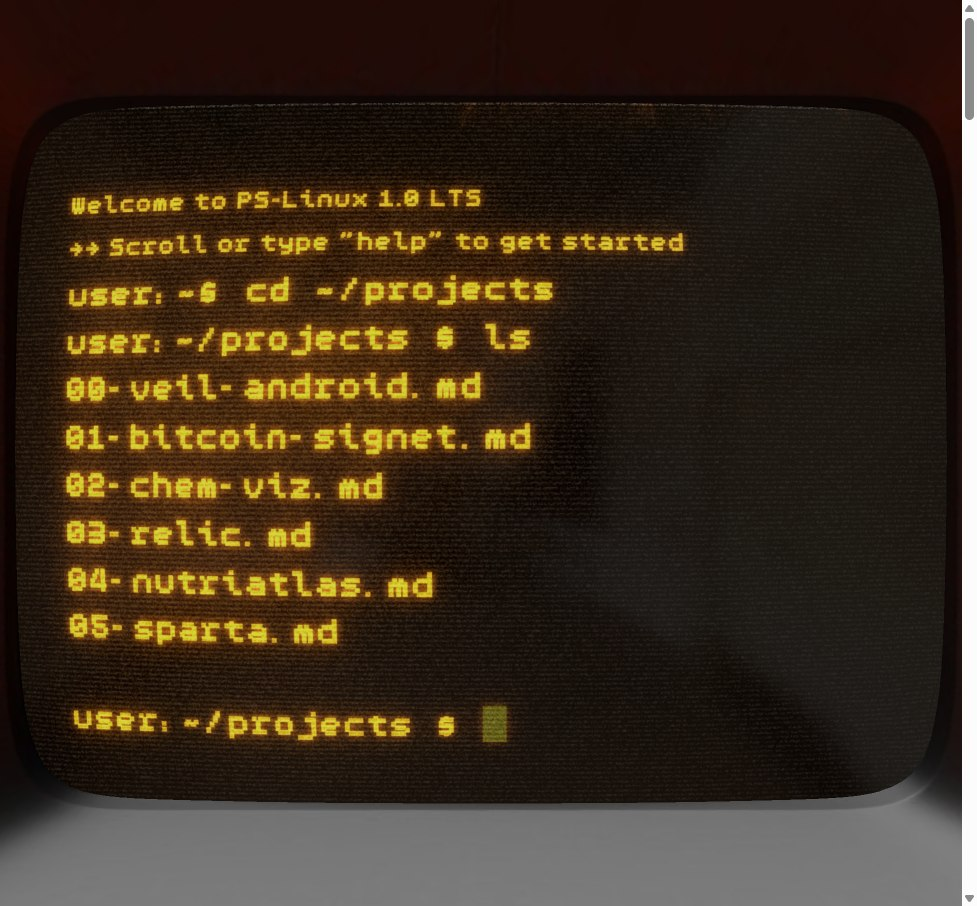

### Project cards stack as you scroll

Each card pins under the one before it, scaling down and dimming as it gets
covered, so the stack reads as depth rather than as flat sheets.

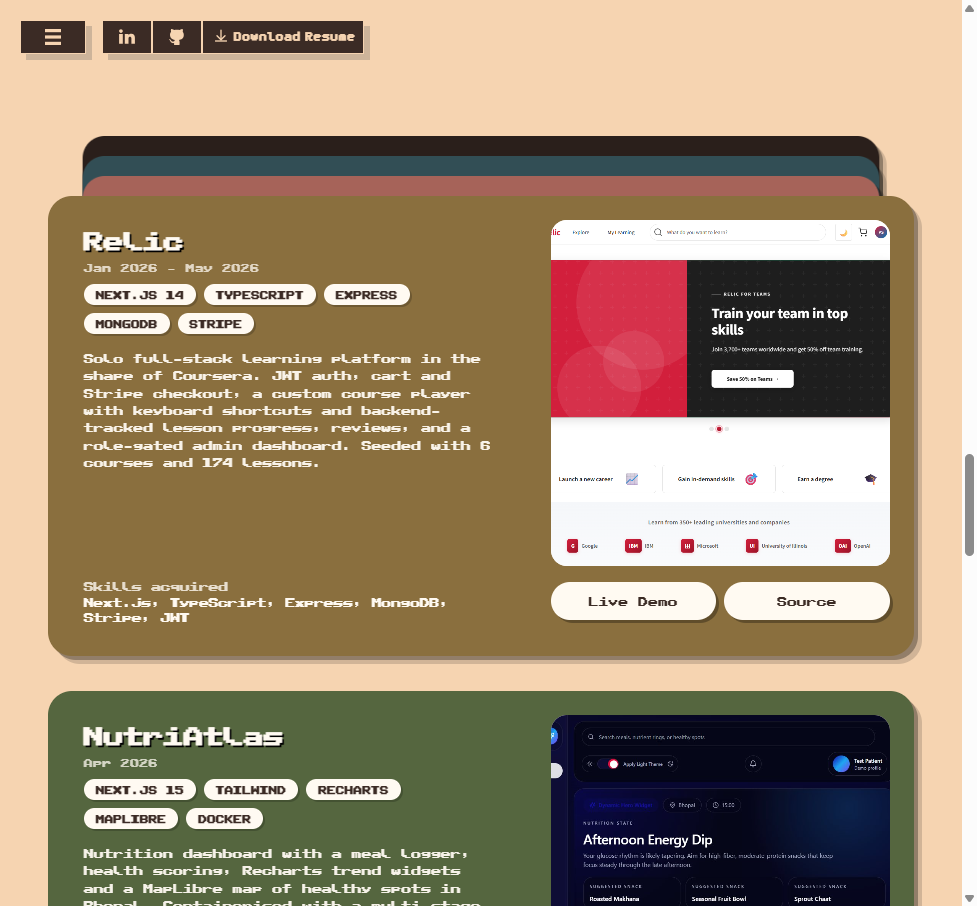

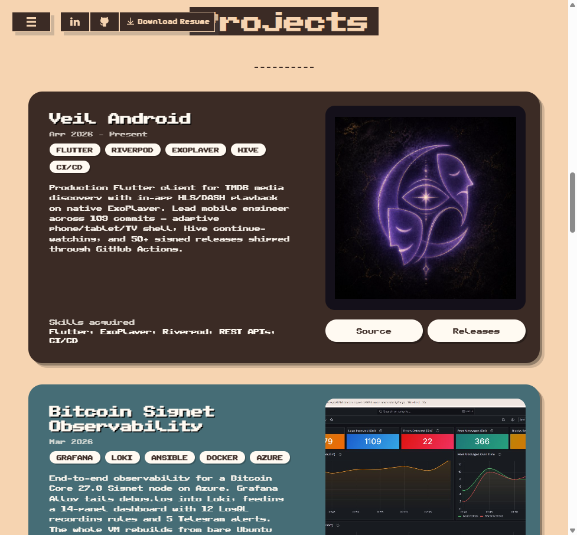

### Achievements and contact

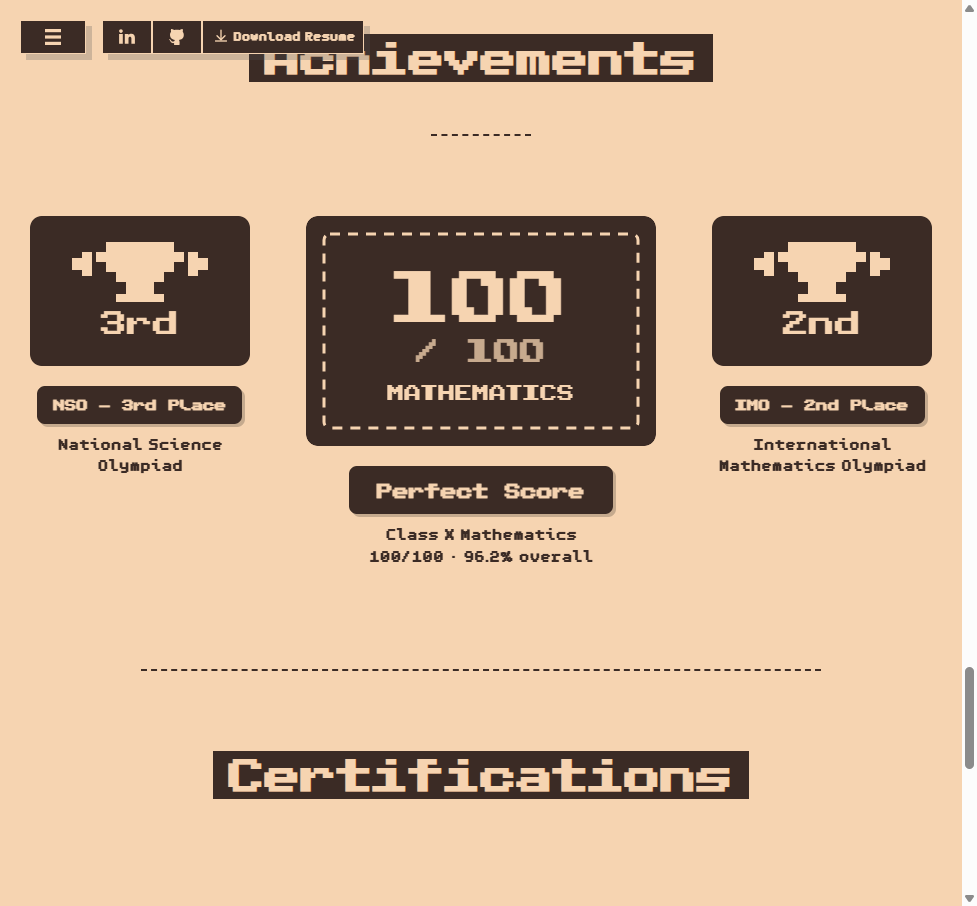

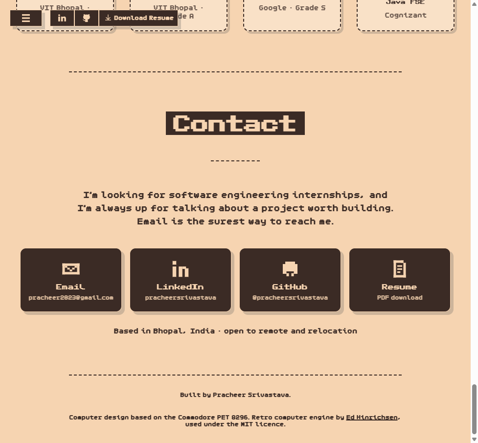

---

## How the CRT is drawn

The screen is not a texture or a video. It is a second Three.js scene rendered
to a texture every frame, pushed through a small post-processing chain, and
mapped onto the `Screen` mesh of the GLB model.

```mermaid
flowchart LR
    MD["Markdown<br/>src/file-system/**"] --> TE["Text engine<br/>glyphs to geometry"]
    TE --> RTT["sceneRTT<br/>orthographic camera"]
    RTT --> BLOOM["UnrealBloomPass"]
    BLOOM --> LAG["Phosphor lag<br/>previous frame blend"]
    LAG --> NOISE["Noise + scanline<br/>fragment shader"]
    NOISE --> TEX["Render target texture"]
    TEX --> MESH["Screen mesh<br/>Commodore710.glb"]
    MESH --> MAIN["Main scene + camera"]
    MAIN --> CANVAS["canvas.webgl"]
```

Text is real geometry, not a bitmap font. Each character becomes a
`TextGeometry` from a pixel typeface, and the whole run is merged into a single
mesh per frame so the draw call count stays flat no matter how much you print.

## How the shell works

Typing anywhere focuses a hidden `<input>`. Its value is diffed against the
previous value to produce an edit, which the text engine replays into the
on-screen input buffer. Enter hands the line to a tiny bash-alike.

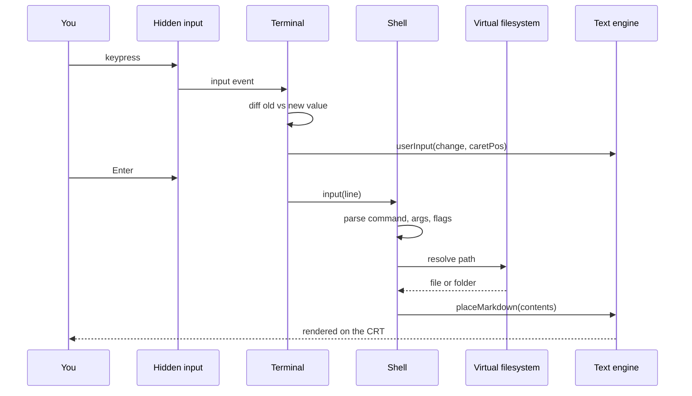

The filesystem is not hand-written. Vite globs the `src/file-system` folder at
build time and reconstructs the tree, so dropping a new `.md` file in makes it
show up in `ls` with no other wiring.

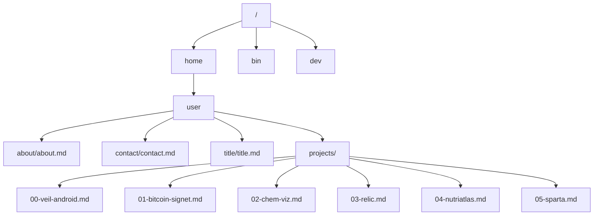

---

## Projects on the site

| Project | What it is | Stack |
|---------|-----------|-------|
| [Veil Android](https://github.com/dikshadamahe/veil-android) | Flutter TMDB client with in-app HLS/DASH playback on native ExoPlayer. Lead mobile engineer, 109 commits, 50+ signed releases. | Flutter, Riverpod, ExoPlayer, Hive, GitHub Actions |
| [Bitcoin Signet Observability](https://github.com/pracheersrivastava/bitcoin-monitoring) | Full observability stack for a Bitcoin Core Signet node on Azure. 14-panel dashboard, 12 LogQL recording rules, 5 Telegram alerts, one Ansible playbook. | Grafana, Loki, Alloy, Ansible, Docker, Azure |
| [CHEM•VIZ](https://fossee-web.vercel.app) | FOSSEE (IIT Bombay) screening build. One Django REST API feeding both a React web app and a PyQt5 desktop client. | Django REST, React, Pandas, PyQt5, PostgreSQL |
| [Relic](https://relic-black.vercel.app) | Solo full-stack learning platform — JWT auth, Stripe checkout, custom course player with tracked progress. 6 courses, 174 lessons. | Next.js 14, TypeScript, Express, MongoDB, Stripe |
| [NutriAtlas](https://nutriatlas-five.vercel.app) | Nutrition dashboard with meal logging, Recharts trends and a MapLibre map. Shipped to Cloud Run via a multi-stage Docker build. | Next.js 15, Tailwind, Recharts, MapLibre, Docker, GCP |
| [SPARTA](https://github.com/pracheersrivastava/SPARTA_Extension) | Manifest V3 extension that flags phishing URLs, backed by a scikit-learn classifier behind a Flask API. | Python, Flask, scikit-learn, Manifest V3 |

---

## Running it locally

```bash
npm install
npm run dev      # localhost:1234
npm run build    # type-check + production build into dist/
npm run preview  # serve the built output
```

Node 20+.

## Editing content

Content lives in two places, and a project change means touching both.

| What | Where |
|------|-------|
| Page sections, cards, achievements, certifications, contact | `index.html` |
| CRT terminal content | `src/file-system/home/user/**/*.md` |
| Project screenshots | `public/images/projects/` |
| Resume served by the nav button | `public/Pracheer-Srivastava-Resume.pdf` |
| Card colours, stack behaviour, section styling | `src/cards.css` |

The terminal markdown dialect is deliberately small:

| Syntax | Result |
|--------|--------|
| `#`, `##`, `###` | Heading sizes (largest to smallest) |
| `*text*` | Inverted highlight block |
| `!(/path.png?aspect=2&width=1.33&noflow=true)` | Image plane behind the text |
| anything else | Body copy, wrapped to the screen width |

One catch worth knowing: every character has to exist in the bundled pixel
fonts. A glyph that is missing throws inside `TextGeometry`, which kills the
render loop and leaves you with a black screen rather than a missing character.

---

## Deployment

Every push to `main` builds and publishes to GitHub Pages. No `gh-pages`
branch, no committed `dist` — the artifact goes straight from the runner to
Pages.

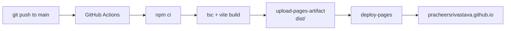

`npm run build` runs `tsc` before Vite, so a type error fails the deploy rather
than shipping.

---

## Credits

The retro computer engine — the 3D scene, CRT post-processing chain, text
layout engine, shell and virtual filesystem — is
[`retro-computer-website`](https://github.com/edhinrichsen/retro-computer-website)
by [Ed Hinrichsen](https://edh.dev/), used under the MIT licence. The machine is
modelled on the Commodore PET 8296. See [`LICENSE.MD`](LICENSE.MD).

Content, copy, page sections, card stack, achievements, certifications, contact
and styling are mine.

### Changes from upstream

Two of these are bug fixes worth calling out, because both fail silently.

- **`screenWidth` is now a build-time constant.** Upstream read it from an
  obfuscated third-party script hosted on a CDN. When that script does not
  load, the constant is undefined, the text engine throws on first paint, the
  render loop never starts and the entire page is black. It is now defined in
  `vite.config.ts` (`1.396`, derived from the CRT camera frustum), and the site
  loads no external JavaScript at all.
- **`body` uses `overflow-x: clip`, not `hidden`.** `hidden` makes the body a
  scroll container, which silently disables `position: sticky` on descendants —
  the project cards simply refuse to stack.
- Added `src/cards.css` for the card stack, achievements, certifications and
  contact grid.
- Added `src/cardStack.ts` (scroll-linked scale and dim on stacked cards) and
  `src/reveal.ts` (one-shot intersection reveal). Both respect
  `prefers-reduced-motion`.
- Added the GitHub Pages workflow.

## Licence

MIT — see [`LICENSE.MD`](LICENSE.MD).
